# 💇 Service Booking Platform (Week 8 - Part 2)

A complete MERN Stack Service Booking Platform where customers can browse services, book appointments, make payments, receive Email & SMS notifications, and manage bookings through a user-friendly dashboard.

---

# 🚀 Live Demo

### Frontend
```
Add your Vercel URL here
```

### Backend API
```
Add your Render URL here
```

---

# 📂 GitHub Repository

https://github.com/PittaShirisha-hub/Week8-part2--06-Fullstack-Webthism.git

---

# 📌 Features

## Customer

- User Registration
- User Login
- Browse Services
- Book Appointment
- Secure Payment
- Booking History
- Update Booking Status
- Delete Booking
- Payment Success Page
- Payment Failure Page

---

## Admin

- Add New Service
- View All Services
- Manage Bookings
- Confirm Bookings
- Complete Bookings
- Cancel Bookings
- Delete Bookings
- Dashboard Statistics

---

## Notifications

- Email Notification using Nodemailer
- SMS Notification using Twilio

---

# 🛠 Tech Stack

## Frontend

- React.js
- React Router DOM
- Axios
- CSS
- React Date Picker

## Backend

- Node.js
- Express.js
- MongoDB
- Mongoose

## Payment

- Custom Payment Module

## Notifications

- Nodemailer
- Twilio

---

# 📁 Project Structure

```
service-booking-platform/

│
├── backend/
│   ├── controllers/
│   ├── middleware/
│   ├── models/
│   ├── routes/
│   ├── utils/
│   ├── server.js
│   └── .env
│
├── frontend/
│   ├── src/
│   │   ├── components/
│   │   ├── pages/
│   │   ├── App.jsx
│   │   └── main.jsx
│   │
│   └── public/
│
└── README.md
```

---

# ⚙ Installation

## Clone Repository

```bash
git clone https://github.com/PittaShirisha-hub/Week8-part2--06-Fullstack-Webthism.git
```

---

## Backend Setup

```bash
cd backend
npm install
```

Create a `.env` file inside the backend folder.

```env
PORT=5000

MONGO_URI=mongodb+srv://<USERNAME>:<PASSWORD>@<CLUSTER>.mongodb.net/serviceBookingDB

JWT_SECRET=your_jwt_secret

EMAIL_USER=your_email@gmail.com
EMAIL_PASS=xxxx xxxx xxxx xxxx

TWILIO_ACCOUNT_SID=ACxxxxxxxxxxxxxxxxxxxxxxxxxxxxxxxx
TWILIO_AUTH_TOKEN=xxxxxxxxxxxxxxxxxxxxxxxxxxxxxxxx
TWILIO_PHONE_NUMBER=+1XXXXXXXXXX
```

Run Backend

```bash
npm start
```

or

```bash
node server.js
```

---

## Frontend Setup

```bash
cd frontend

npm install

npm run dev
```

---

# 📡 API Endpoints

## Authentication

```
POST /api/auth/register

POST /api/auth/login
```

---

## Services

```
GET /api/services

POST /api/services

PUT /api/services/:id

DELETE /api/services/:id
```

---

## Bookings

```
GET /api/bookings

POST /api/bookings

PUT /api/bookings/:id/status

DELETE /api/bookings/:id
```

---

## Payments

```
POST /api/payments

GET /api/payments
```

---

# 📧 Email Notification

Email notification is automatically sent when:

- Booking is Confirmed

Technology Used:

- Nodemailer
- Gmail SMTP
- App Password

---

# 📱 SMS Notification

SMS notification is automatically sent when:

- Booking is Confirmed

Technology Used:

- Twilio Messaging API

---

# 💳 Payment Flow

Customer

↓

Select Service

↓

Choose Date & Time

↓

Payment

↓

Booking Created

↓

Payment Stored

↓

Confirmation Email

↓

Confirmation SMS

↓

Booking History

---

# 📸 Screenshots

## Home Page


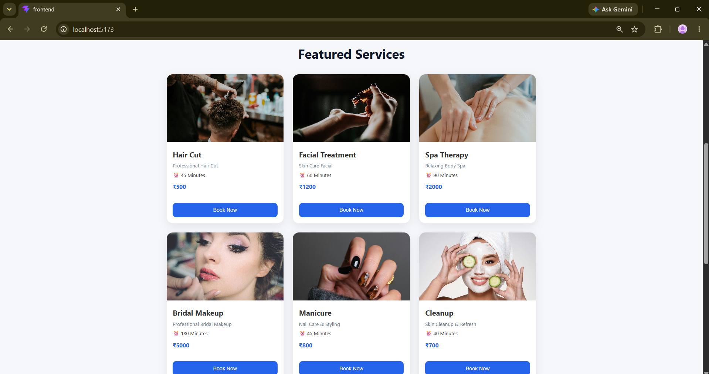

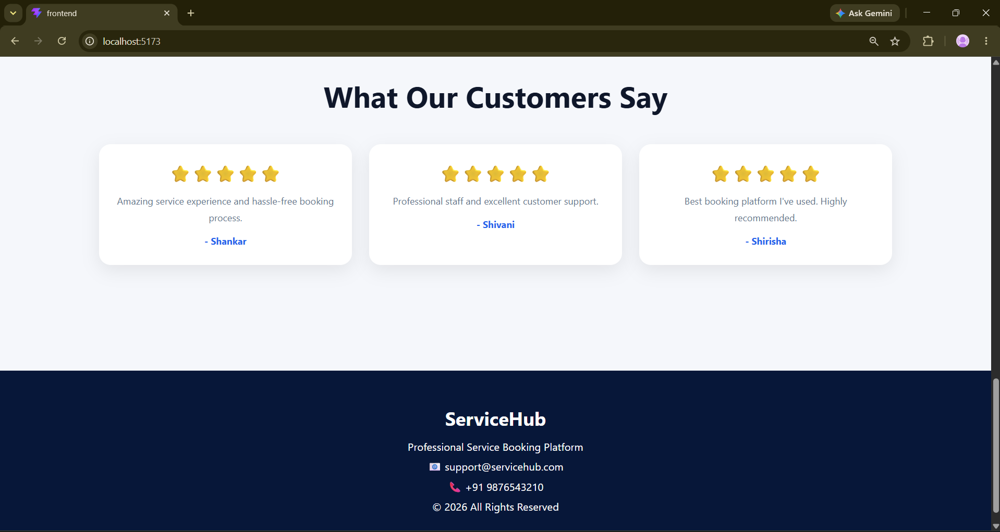

---

## Register

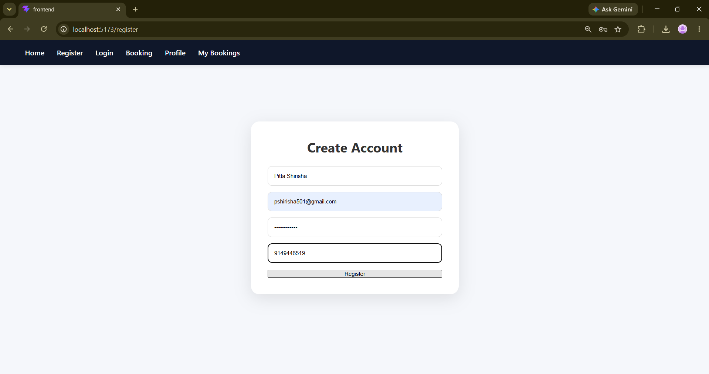

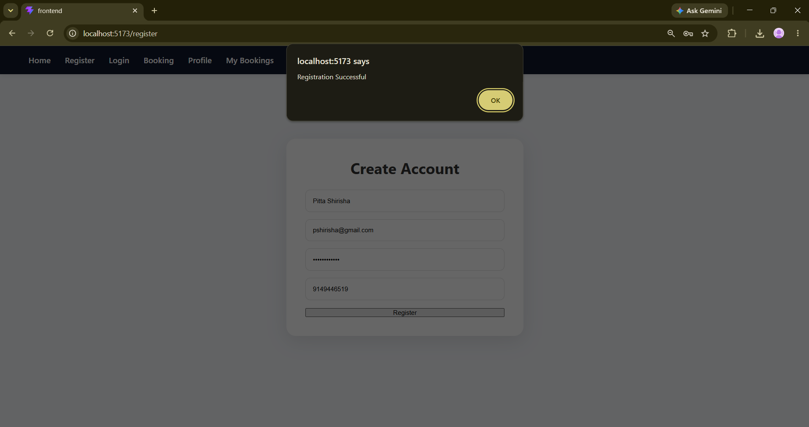

---

## Login

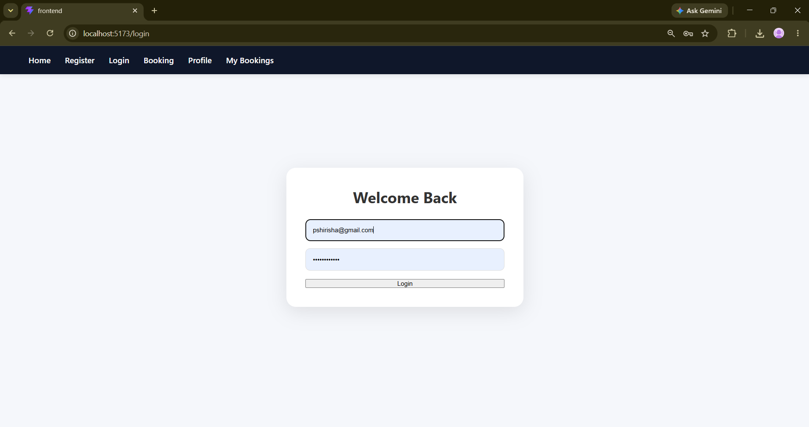

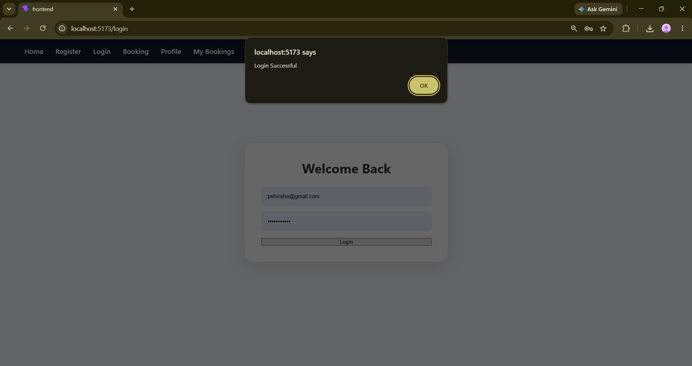

---

## Booking

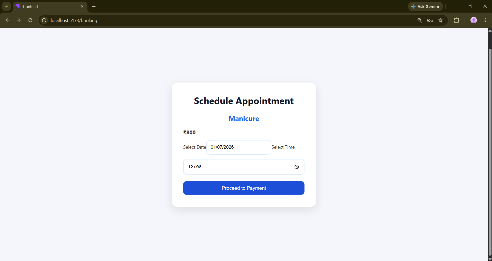

---

## Payment

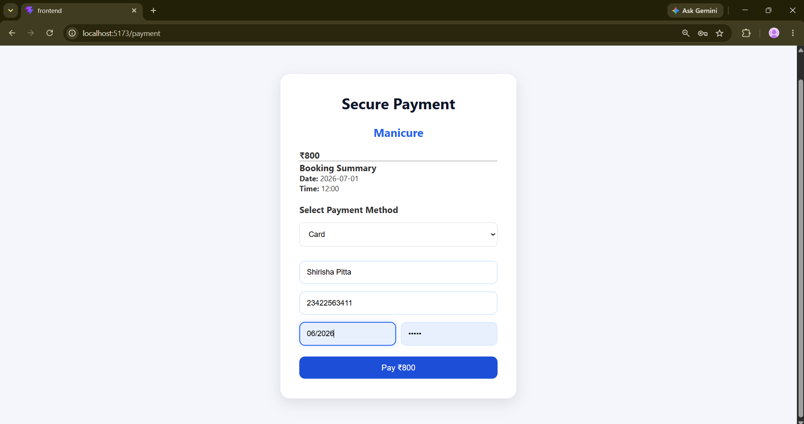

---

## Payment Success

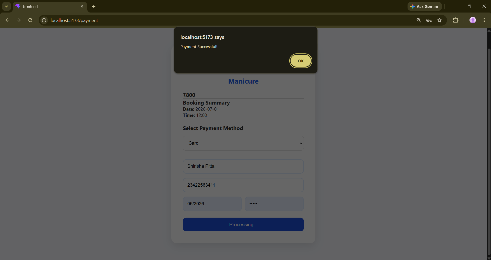

---

## My Bookings

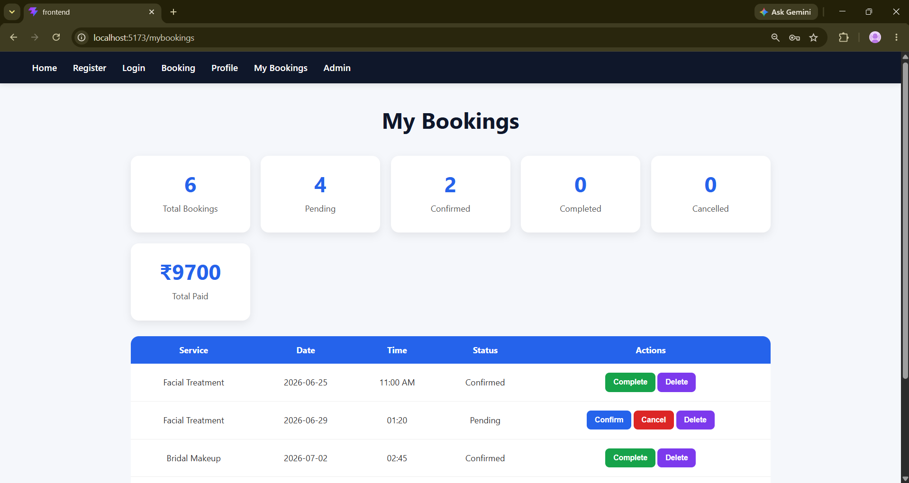

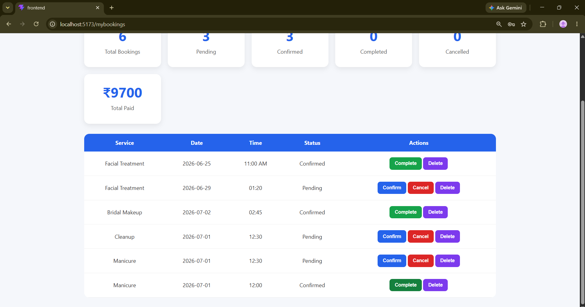

---

## Admin Dashboard

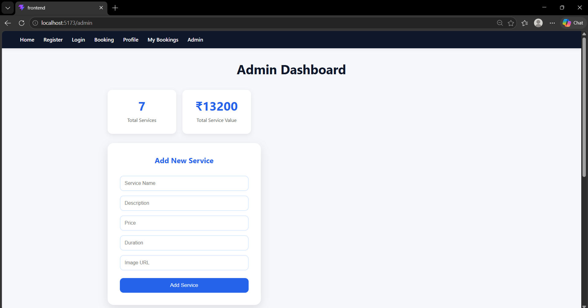

---

## Add Service

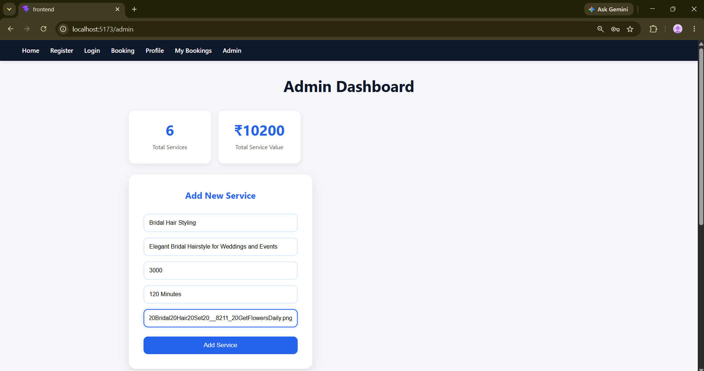

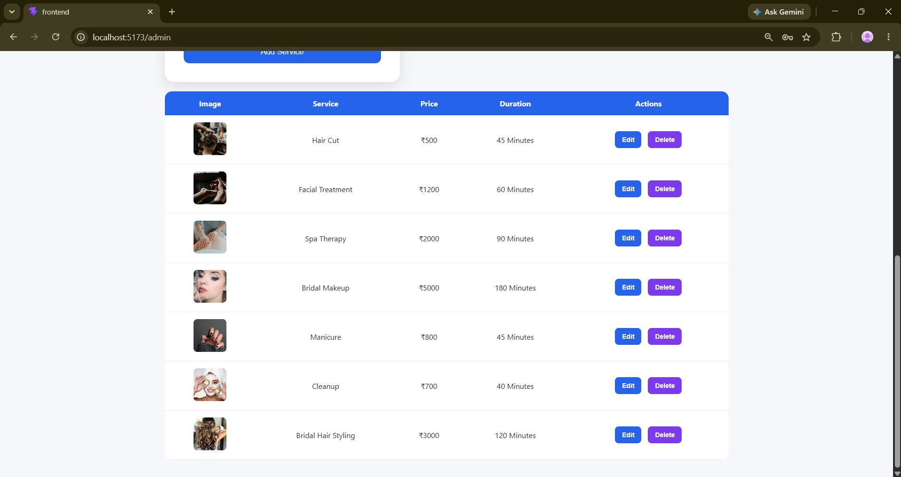

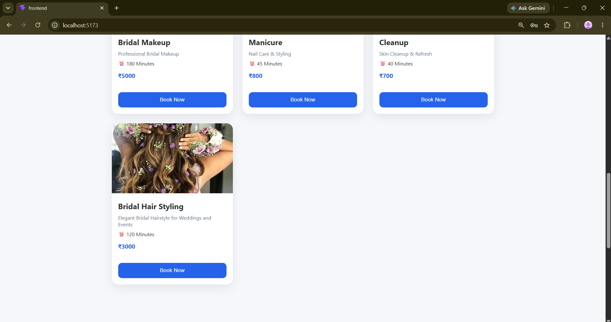

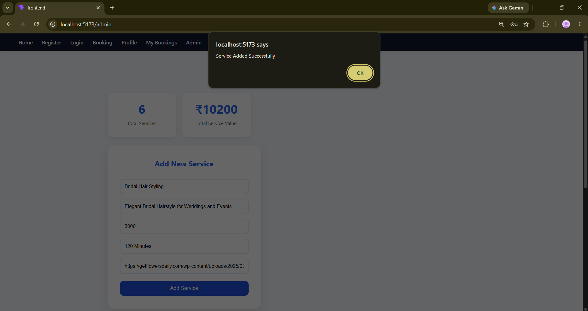

---

## Email Notification

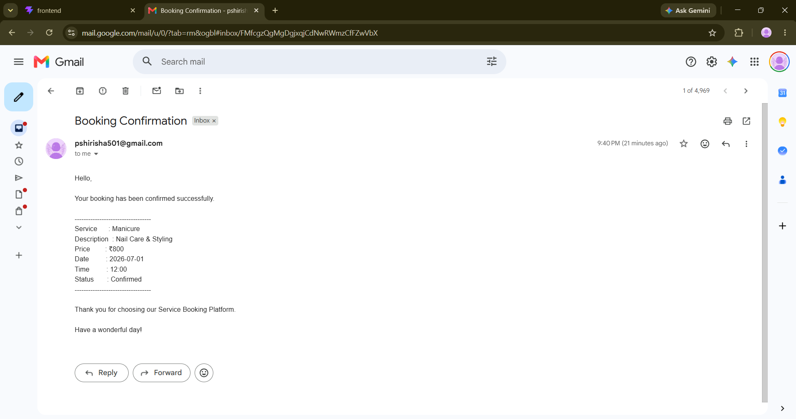

---

## SMS Notification

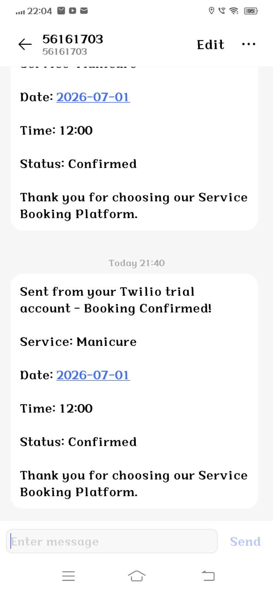

---

# 🔐 Security

- JWT Authentication
- Environment Variables
- MongoDB Atlas
- Secure API Routes
- Password Hashing
- Twilio Authentication
- Gmail App Password

---

# 📦 Deployment

Frontend

- Vercel

Backend

- Render

Database

- MongoDB Atlas

---

# 👩‍💻 Developer

**Shirisha Pitta**

GitHub

https://github.com/PittaShirisha-hub

---

# ⭐ Future Improvements

- Razorpay Integration
- User Profile Management
- Admin Analytics Dashboard
- Search & Filter Services
- Service Categories
- OTP Verification
- Push Notifications
- Appointment Reminders

---

# 📄 License

This project is developed for educational purposes as part of the Full Stack Web Development Program.

---

## ⭐ If you like this project, don't forget to Star the Repository.# Week8-part2--06-Fullstack-Webthism
